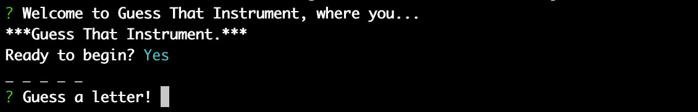
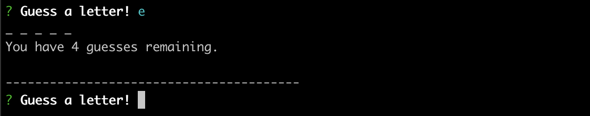
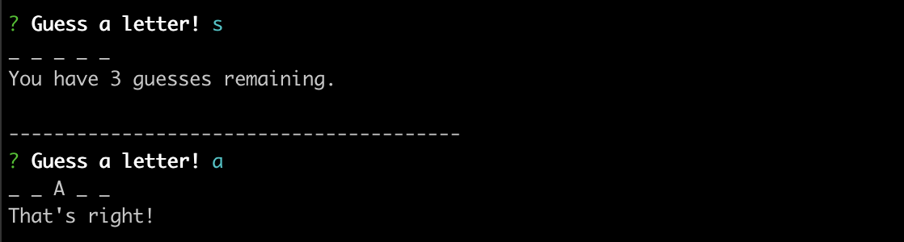
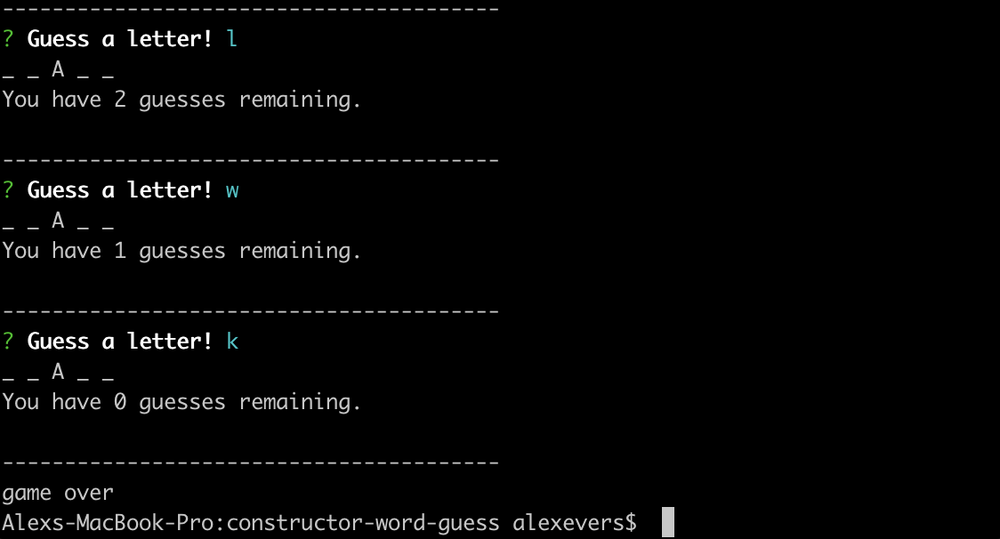
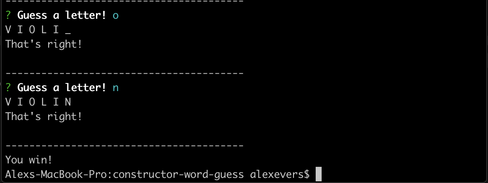

# constructor-word-guess

This application is a command-line-interface game in which the user guesses the letters of a hidden word. Each letter and word is created using Javascript classes and constructor functions. These functions are divided by responsibility and spread among 3 files: index.js, word.js, and letter.js.

## index.js
Although this is a Node app that runs in the command line, index.js can essentially be thought of as the 'front end' of this application. It is the component with which users will interact directly and is powered by the other two JS files. The main responsibilities of this file include selecting a random word for the user to guess, taking in guesses from the user, and keeping track of the number of guesses remaining.

## word.js
This is the file that actually constructs the word to be guessed. It contains the Word constructor, which depends on letter.js and is called from index.js. It concatenates the letter objects created by letter.js into a string of underscores and characters, then pushes that to index.js, where it can be printed to the console.

## letter.js
This file contains the Letter constructor function, which takes each letter of the hidden word and creates an object that holds additional information about the letters, such as whether or not they have been guessed. This constructor can also take in a user-guessed character and compare it with the letters in the hidden word to return either the hidden letter itself or an underscore.

## Application flow
When the app is loaded, a welcome message is displayed. We ask the user if they're ready to start the game.

Assuming the user responds 'YES,' we jump right into gameplay. A word is randomly selected from the wordbank, and the constructor functions are called to build out the hidden word, which at this point will be a string of underscores.

The user then enters a letter as their guess. If it's incorrect, the hidden word will remain as is and the number of remaining guesses will be printed to the screen. With each incorrect guess, a counter variable for guesses remaining will decrement inside index.js.

If the user guesses correctly, the guessed letter will be revealed in the hidden word. Correct guesses will not affect the number of guessses remaining.

This gameplay cycle will continue until either the user runs out of guesses...

or until the word is completely guessed.

At either of these points, the functions will exit and the user will be informed whether they've won or lost. 

The technologies used to build this application include Node.js, NPM Inquirer, and NPM FS.

This application was created and is maintained by Alex Evers.